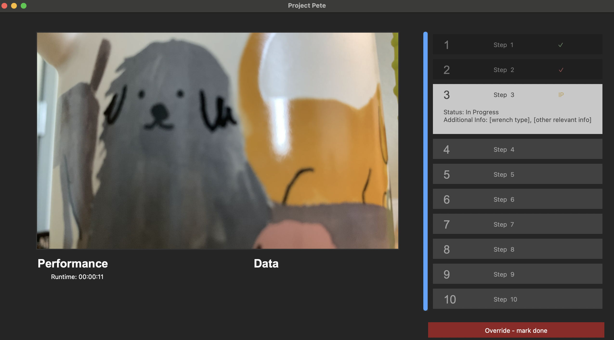
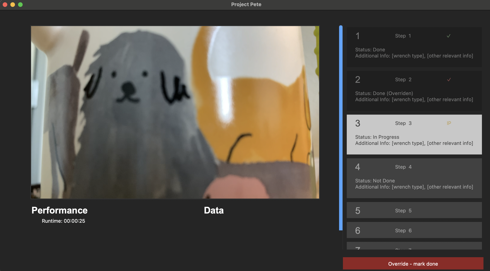
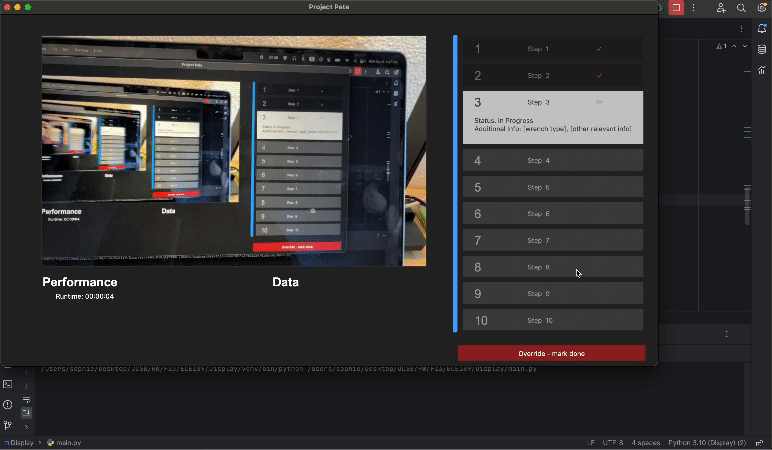

# ECE189 Display (Draft)

Very rough Figma design: [Link](https://www.figma.com/file/YM6YA7H9epS9IwEm6eBoAy/ECE189-Diagram?type=design&node-id=27%3A2&mode=design&t=DkY9WNOVUdd2IV9z-1)

Idk what to put on there, but this is what it looks like w some dummy data:

### Initial 

### Different task statuses

### What it looks like w/ button override
